### 基于SpringBoot的仿知乎资讯系统

功能
 1. 用户注册登录
  - 注册：异步发送激活邮件
  - 登录：判断是否登录异常，并在异常时向用户发送邮件
  - 登录成功后在数据库中存放 `token` 信息及有效时间，并下发到用户 `cookie` 中，用户拿到 `token` 后，请求服务端时，先经过 `Spring` 拦截器验证是否为有效 `token` 。 `Interceptor` 解析出用户身份信息，存至 `ThreadLocal` 中，方便后续使用。若为无效 `token` 信息，则重定向至登录页。
  -  `token` 失效时间一般为15天，采用 `https` 进行传输，即可以防止 `token` 被窃用。或者采用 `refresh_token` 和 `token` 结合的策略。
 2. 发帖
  - 用户登录后可以发帖，服务端将帖子信息进行 `HTML` 转义，防止 `XSS` 攻击。并通过自定义的敏感词过滤算法，将敏感词替换为 `***` 。起初使用的是将文本与所有敏感词一一匹配的算法，导致效率很低。后来改用前缀树匹配敏感词进行过滤的策略进行优化，使得算法复杂度降低了很多。
  - 用户发帖后可以进行评论，评论也进行了敏感词过滤和 `HTML` 转义。
  - 用户发帖后还可以对其进行点赞操作，将对应帖子的点赞用户 `ID` 存至 `Redis` 的 `Set` 中，由于 `Redis` 的数据都在内存中，所以查询效率很高。
 3. 关注和取关
  - 用户可以关注别人和取消关注别人，对应的关注数据会存至 `Redis` 的 `ZSet` 中，并根据关注时间进行排序。由于 `Redis` 的 `ZSet` 底层基于字典和跳跃表实现，因此查询时间复杂度为 `O(1)` ，修改时间复杂度为 `O(logN)` ，效率很高。
  - 利用 `ZSet` 求交集，获取共同关注用户列表。
 4. 用户私信
  - 不同用户之间可以相互发送消息，数据会存至Mysql表中，并利用 `conversation_Id` 进行唯一标记，用 `to_userId` 和 `from_userId` 区分发送者和接收者，使得消息只用保存一份。
 5. 异步框架(此处也可采用比较成熟的消息队列中间件)
  - 由于某些操作执行后可能会触发其他的操作，比如用户关注了另一个用户，那么另一个用户将会收到一条站内信，通知他被`xxx`关注。此外还有点赞、评论、异常登录等操作存在这种情况。
  - 如果采用同步操作的话，当另一个业务出现故障，会导致操作失败，或者线程阻塞，甚至可能消耗线程资源，使得整个系统崩溃。采用异步操作可以避免某些业务故障导致整体操作失败的情况。
  - 异步框架采用的是消费者和生产者模型，消费者开一个线程，负责轮询 `Redis` ，检查是否有事件发生。
  - 在需要调用异步框架的地方会触发一个对应类型的事件，然后存至 `Redis` 的 `list` 中，由于 `list` 底层采用的是双向链表，可以将其看做队列使用。
  - 由于 `Redis` 的单线程模型，使得队列是线程安全的。
  - 需要处理事件，就创建一个 `Handler` 接口子类，注册对应时间，并实现对应的处理逻辑。
  - 在 `Spring` 容器初始化时，可以利用 `ApplicationContext` 获取 `Handler` 接口的全部子类，并注册所有子类监听的事件类型，当有事件到达是，调用对应 `Handler` 的处理方法，执行异步操作。

**登陆界面：**

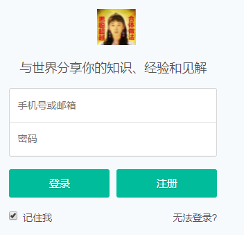

**导航栏（登陆前）：**

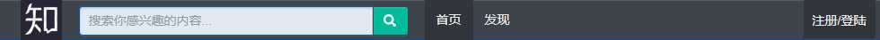

**导航栏（登陆后）：**

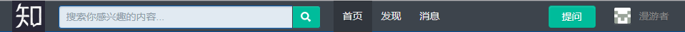

**个人信息导航：**

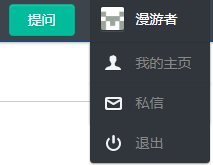

## 问题管理

**问题发布：**

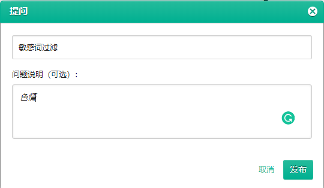

**敏感词过滤（内容已被过滤）：**

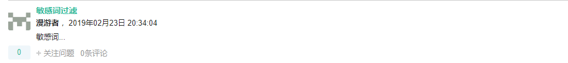

**问题广场（首页显示）：**

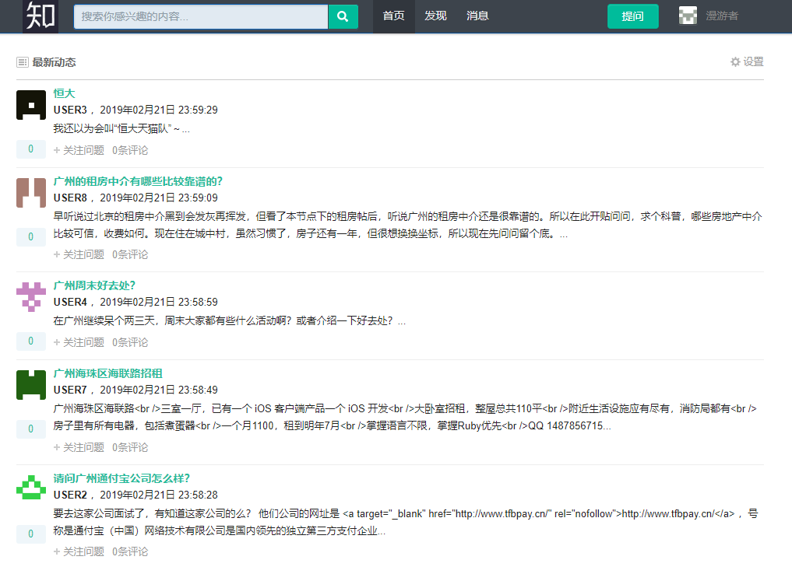

## 评论中心与站内信

**评论页面：**

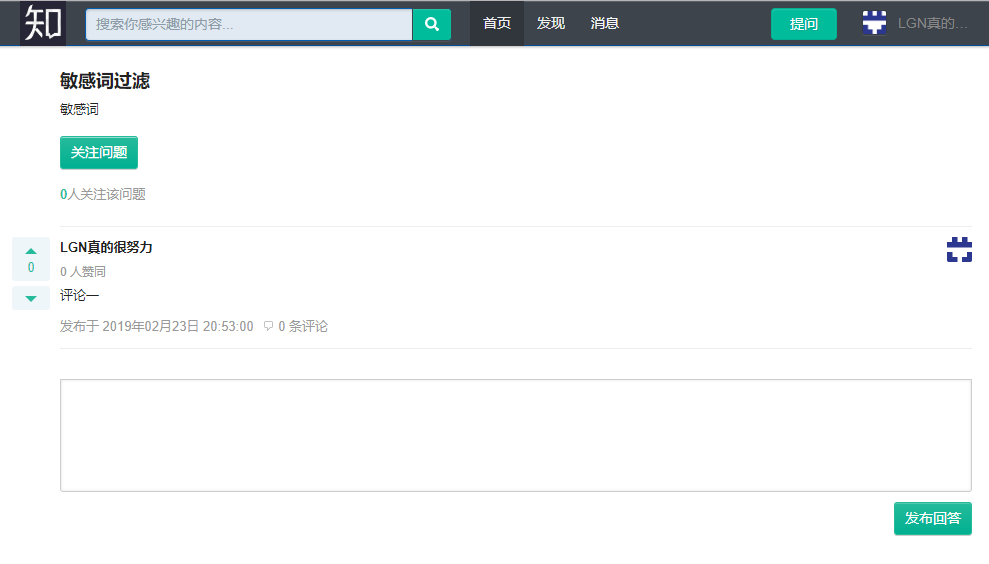

**个人站内信：**

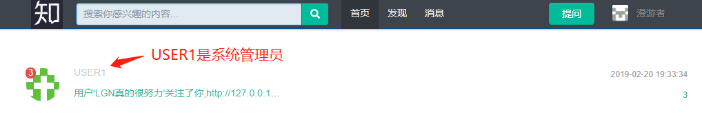

**站内信详情：**

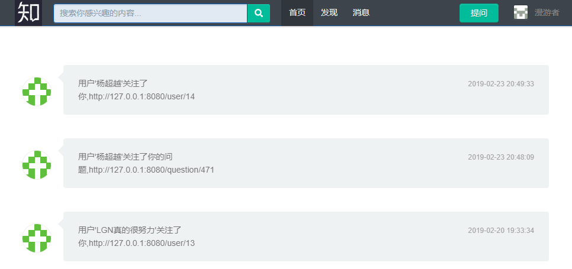

## Redis实现赞踩功能

**评论的赞踩：**

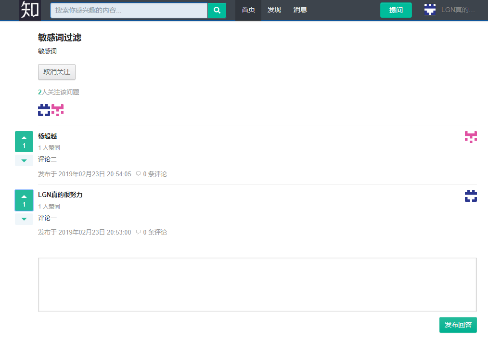

## 异步设计

**异步设计原理：**

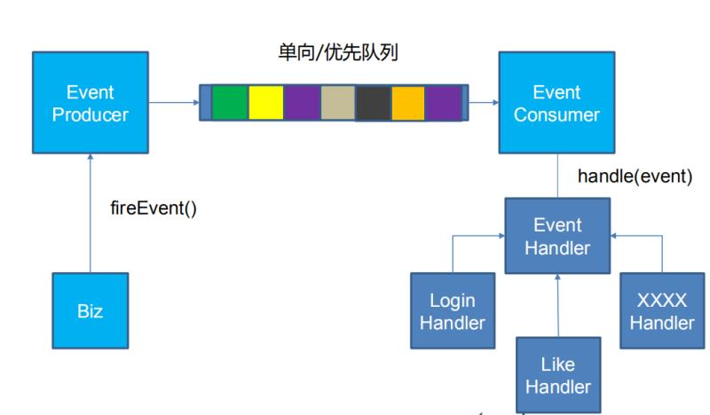

## sns关注功能和粉丝列表页实现

**用户关注：**

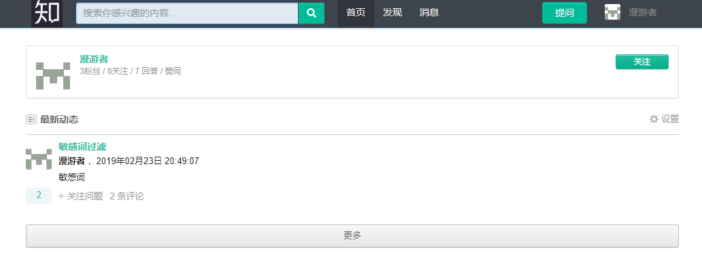

**关注列表：**

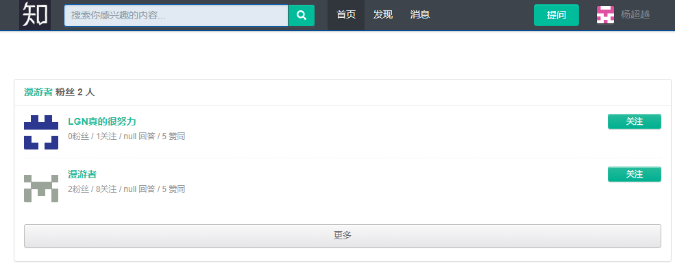

**问题关注：**

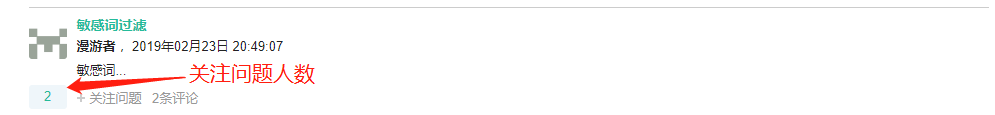
